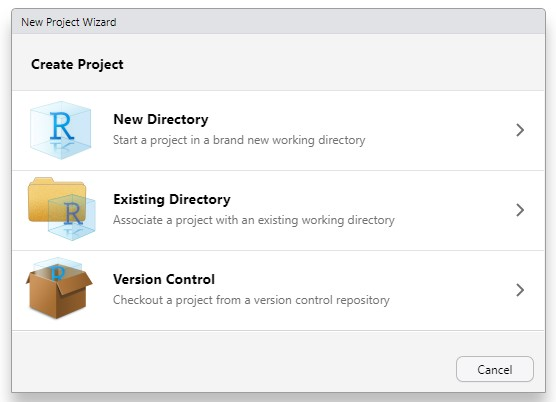
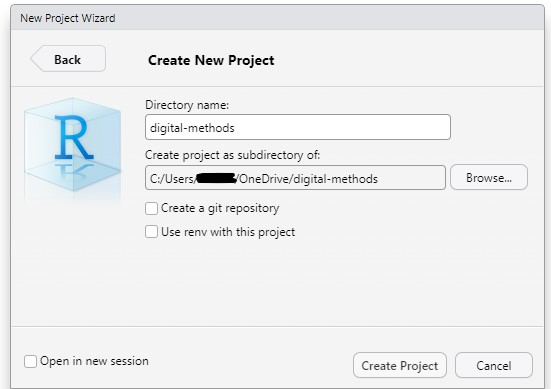
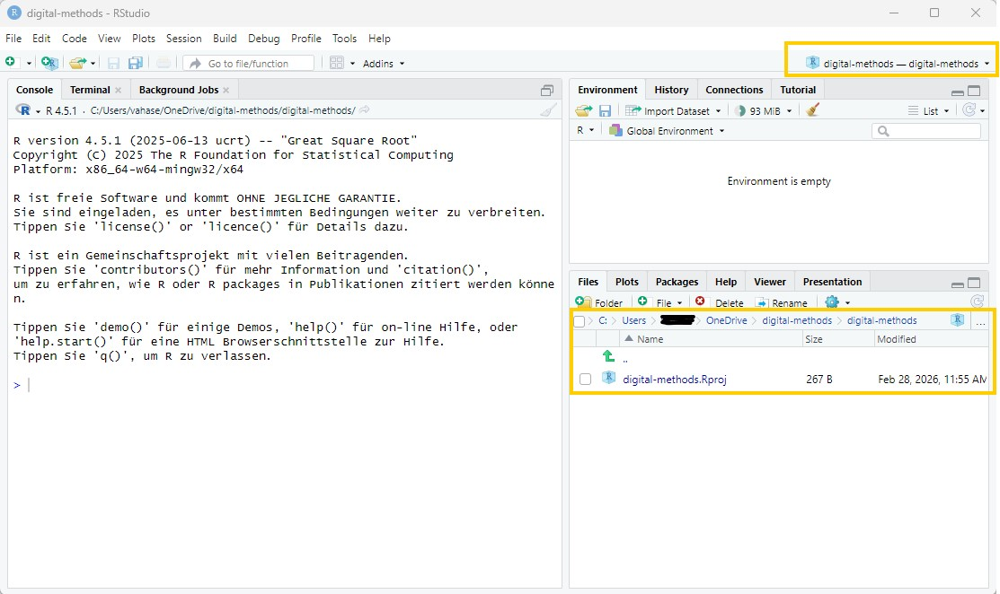
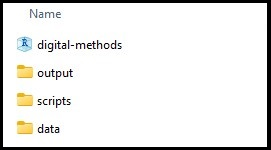
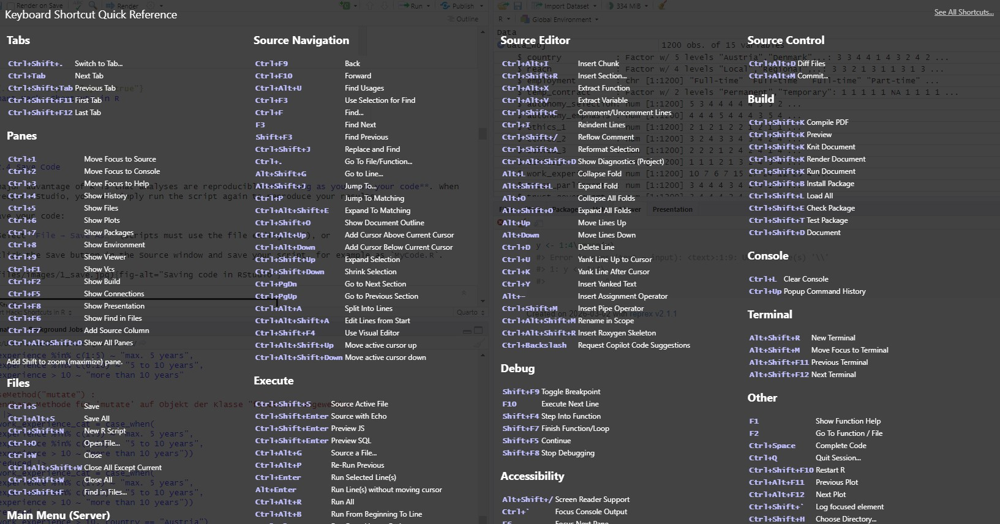

::: callout-note
## 🎯 Learning goals

After working through Tutorial 2, you'll...

-   know what each window (panel) in RStudio does
:::

## 1. What does each window in RStudio do?

RStudio is a graphical interface (like an app) that makes it easier to work with R. It usually contains **four main windows (panels)**, each with a different purpose:

-   **Source (Script Editor):** Write and save your code. **Important**: After installing R/RStudio, you may not see this window right away. To open it, click *File → New File → R Script*.

-   **Console:** Run code. This is where commands are executed and results are shown.

-   **Environment:** View the objects you have created (e.g., datasets, variables, lists).

-   **Files / Plots / Packages / Help:** Manage files, view plots, install/update packages, and look up help pages.

*Image: Four main windows in RStudio*

{fig-alt="Overview of panels in RStudio"}

Your layout may look slightly different. The four-panel setup shown here works well for many people, but feel free to adjust it.

To change the layout, go to *Tools → Global Options → Pane Layout*.

*Image: Changing the layout*

{fig-alt="Changing the layout in RStudio" width="483"}

## 2. Source: Write your own code

In the Source window, you write the code that tells R what task to perform.

### 2.1 Write code

Let’s start with a simple example. Suppose you want R to print the word `"hello"`. First, we create an **object** called *word* and assign the value `"hello"` to it.

Values are assigned to objects using either the operator `<-` or `=`. The **left side** contains the object name, and the **right side** contains the value that should be stored in that object.

The following command tells R to assign the word `"hello"` to an object called *word*:

```{r,hello-1, eval = TRUE, echo = TRUE}
word <- "hello"
```

In R, you would use then use the Source window to do this:

{fig-alt="Overview of the source panel in RStudio" width="831"}

### 2.2 Comment code

R allows you to add comments to your code. This is helpful when you return to your script later, especially once your code becomes longer and you may have forgotten what specific code elements do.

Comments are created using a hashtag `#`. Everything after `#` **is ignored by R** and treated as a note for humans only (so not run as code). In the following, everything after the hashtag is purely a "mental note" to yourself:

```{r, notes, eval = FALSE, echo = TRUE}
# this line of code assigns the word "hello" to an object called word
word <- "hello"
```

You can also use hashtags to structure your script into sections - similar to headings in a Word document. If you add four hashtags before a heading `####`, RStudio creates a section header that helps you navigate through your script. This is especially useful for long files.

{fig-alt="Structuring code in RStudio"}

### 2.3 Execute Code

Next, we want to run (execute) our code.

1.  Select the line(s) of code you want to run.

2.  Click Run (top right of the Source window), or press:

-   Ctrl + Enter (Windows)

-   Cmd + Enter (Mac)

R will execute exactly the selected lines and create the object word. If no code is selected, only the current line (where your cursor is placed) will run.

{fig-alt="Executing code in RStudio" width="831"}

Some commands take longer to run. If you notice an error while code is executing, you can stop it manually using the **Stop** button in the *Console* (visible only while R is running). Alternatively, use *Session → Interrupt R*.

{fig-alt="Interrupting code in RStudio"}

Usually, I recommend waiting rather than quickly interrupting R.

### 2.4 Save Code

One major advantage of R is that analyses are reproducible, **as long as you save your code**. When you reopen RStudio, you can simply run the script again to reproduce your results.

To save your code:

-   Select *File → Save As…* (scripts must use the file ending `.R`), or

-   Click the Save button in the Source window and save your script, for example as `MyCode.R`.

{fig-alt="Saving code in RStudio"}

## 3. Console: Print results

The results of executed code appear in the **Console**, another main window in RStudio. The Console shows both the commands you run and the output produced by R.

In the previous example, we created an object called *word* that stores the value `"hello"`. When we run code, R prints the executed code and results (if requested).

For example, typing the object name and running the line will display its content:

```{r,hello-3, eval = TRUE, echo = TRUE}
word <- "hello"
word
```

*Image: Window "Console"*

{fig-alt="Console panel in RStudio"}

## 4. Environment: Overview of objects

Another important window is the **Environment**. It shows all objects that currently exist in your R session—right now, that’s just the object *word*. As you create more objects (datasets, variables, results, etc.), this list will grow.

If you have worked with SPSS before, you can think of the Environment as a kind of *overview* of what is currently loaded. The key difference is that R can keep **many different objects at the same time**(e.g., datasets, models, or tables), so you can switch between them easily.

*Image: Window "Environment"*

{fig-alt="Environment panel in RStudio" width="600"}

It’s important to know that you can visually inspect many objects (especially datasets) with the function `View()`. This opens the object in a new tab in the Source window. It may not feel very useful yet, but it becomes extremely helpful once you work with larger datasets that contain many observations (rows) and variables (columns).

```{r,hello-4, eval = FALSE, echo = TRUE}
View(word)
```

*Image: Window "View"*

{fig-alt="Viewing data in RStudio"}

## 5. Plots/Help/Packages: Do everything else

Lastly, the standard RStudio interface includes a final important window. In many setups, this panel contains tabs such as "Files", "Plots", "Packages", and "Help". We’ll cover these in more detail later. For now, it’s enough to know that this window is used, for example, to view plots and other output, browse files, and manage additional functions in so-called packages.

*Image: Window "Files/Plots/Packages"*

{fig-alt="Files etc. panel in RStudio"}

## 6. Working with R projects

In this class, we will work with R projects. An **R project** is a feature offered in RStudio: Basically, it creates a dedicated folder to organize and manage files, scripts, and data for a specific analysis (for a longer explanation, see [here](https://www.r-bloggers.com/2020/01/rstudio-projects-and-working-directories-a-beginners-guide/)). You should create a R project for this class and always use this R project.

When you open the `.Rproj` file in RStudio, RStudio treats that folder as your **project home**. All data will be stored in this folder as a so-called root directory. This helps you keep everything in one place.

R Projects therefore work with *relative* instead of absolute paths. Instead of manually setting your working directory (e.g., setwd("Desktop/Data")), an R Project automatically uses the folder in which the project is located as its working directory. Any files stored in this folder (or its subfolders) can then be accessed using relative paths.

### 6.1 What can we use R projects for?

Use a project whenever files belong together, for example:

-   this class
-   a research paper, thesis, or replication project
-   a group project in a research seminar (especially for GitHub collaboration - we will learn about this later)

### 6.2 Why are R projects so useful?

-  *No more “file not found”*: Your project folder becomes the default location, so loading files is simpler.
-   *Cleaner workflow*: You naturally separate data, scripts, and outputs instead of mixing everything. This helps knowing what to find where.
-   *Reproducible work*: If you reopen the project later, you can rerun your code and reproduce your results - especially if you also create virtual environment with packages like `renv`.

### 6.3 How to set up a R project for this class

Follow these steps to create a R project. *Important*: Make sure that this project is stored at a folder you can access over the course of this class (e.g., a folder that is continuously back-uped, for example via the [AAU Seafiles Cloud](https://seafile.aau.at/)).

1.  Click *File → New Project*
2.  Choose *New Directory*

{fig-alt="Creating a R project in RStudio"}

3.  Select *New Project*
4.  Enter a project name (e.g., `digital-methods-class`)
5.  Choose where the folder should be saved. I would recommend a folder that is regularly backed-up (e.g., the AAU Seafiles Cloud)

{fig-alt="Creating a R project in RStudio"}

RStudio will now open a new session inside youR project and automatically create:

-   a project folder
-   a file ending in `.Rproj`

Always open your work by clicking the `.Rproj` file — this ensures the correct settings and working directory are used.

You can check if you are actually opening R via the R project by checking that...

-   the project is shown on top of the Environment window (see yellow mark, top right)
-   the file path under "Files" is shown (see yellow mark, bottom right)

{fig-alt="Creating a R project in RStudio"}

### 6.4 Which folders do I need for this class?

For this class, I recommend using the following folder structure:

``` text
digital-methods/
└── digital-methods.Rproj
├── data/
├── scripts/
│   ├── 01_data_management.R
│   └── 02_analysis.R
└── output/
    ├── results/
    └── images/
```

With this, you have:

-   the R-project (digital-methods.Rproj)
-   a folder called *data* where you can store all data
-   a folder called *scripts* where you can store all scripts
-   a folder called *output* where, in the subfolders *results* and *images* you can store different types of results.

Please make sure to create these three folders (*data*, *scripts*, and *output*) in the same folder where your R project currently lies.

{fig-alt="Recommended folder structure for R"}

Perfect - we are ready to get into the workflow of R now!

## 💡 Take-Aways

-   **Window "Source"**: used to write/execute code in R
-   **Window "Console"**: used to return results of executed code
-   **Window "Environment"**: used to inspect objects on which to use functions
-   **Window "Files/Plots/Packages etc."**: used for additional functions, for instance visualizations/searching for help/activating or updating packages

## 🤓 Smart Hacks

::: {.callout-tip collapse="true"}
## Smart Hack 1: Feel like a coding pro

Want a more “hacky” look and feel like a coding pro?

-   Go to *Tools → Appearance → Editor theme* and try a dark theme like **Chaos**.

-   Enable **rainbow parentheses** via *Tools → Global Options → Code → Display*. This highlights matching parentheses in the same color, which can make code easier to read.
:::

::: {.callout-tip collapse="true"}
## Smart Hack 2: ⌨️ RStudio shortcuts

RStudio has many keyboard shortcuts that speed up coding (running code, formatting, navigating, etc.). You don’t need to memorize them—RStudio shows you the full list.

-   **Find all shortcuts:** *Tools* → *Keyboard Shortcuts Help*\
-   **Search quickly:** Use the search box to look up actions (e.g., “comment”, “format”).
-   **Change shortcuts:** *Tools* → *Modify Keyboard Shortcuts…* (useful if you prefer different keys)

A few high-impact ones to start with:

-   **Run current line/selection:** `Ctrl + Enter` (Windows/Linux) / `Cmd + Enter` (Mac)
-   **Comment/uncomment selection:** `Ctrl + Shift + C` / `Cmd + Shift + C`

{fig-alt="Interrupting code in RStudio"}
:::

## 🎲 Quiz

::::: {.content-visible when-format="html"}


::: {.callout-note icon="false"}
## 🎲 Question 1

**Which of the following statements about R windows are correct?**

```{ojs}
//| echo: false

MC_windows_1 = [
    ["The Source window is used to write and save R code.", "True"],
    ["I can only write code in the Source window.", "False"],
    ["Packages are installed in the Environment window.", "False"],
    ["The Console automatically saves your code permanently.", "False"]
]

viewof answers_windows_1 = quizInput({
  questions: MC_windows_1,
  options: ["True", "False"]
})
```
:::

::: {.callout-note icon="false"}
## 🎲 Question 2

**Which of the following statements about R projects are correct?**

```{ojs}
//| echo: false

MC_projects_mix = [
    ["Opening an .Rproj file automatically sets the correct working directory.", "True"],
    ["R projects work with relative instead of absolute paths.", "True"],
    ["You can have multiple R projects on your computer.", "True"],
    ["You should avoid using setwd() when working inside an R project.", "True"]
]

viewof answers_projects_mix = quizInput({
  questions: MC_projects_mix,
  options: ["True", "False"]
})
```
:::

## 📚 More tutorials on this

You still have questions? The following tutorials & papers can help you with that:

-   [R for Data Science by Wickham et al.](https://r4ds.hadley.nz/)
-   ["wegweisR" by M. Haim, Video 1](https://youtu.be/p6f4oq08z48)
-   ["R Cookbook" by Long et al., Tutorial 1](https://rc2e.com/)
-   ["Tutorial 2 - Wissen macht R" by B. Fretwurst](https://ikmz.pages.uzh.ch/Wissen-macht-R/01-Basics.html)
:::::
