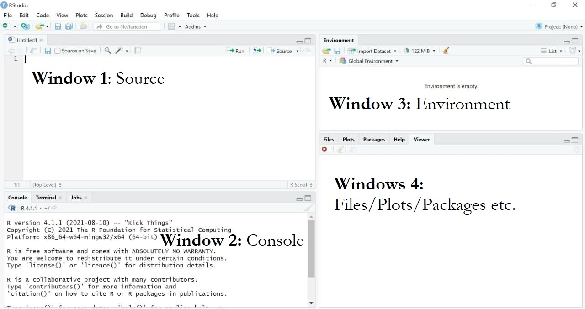
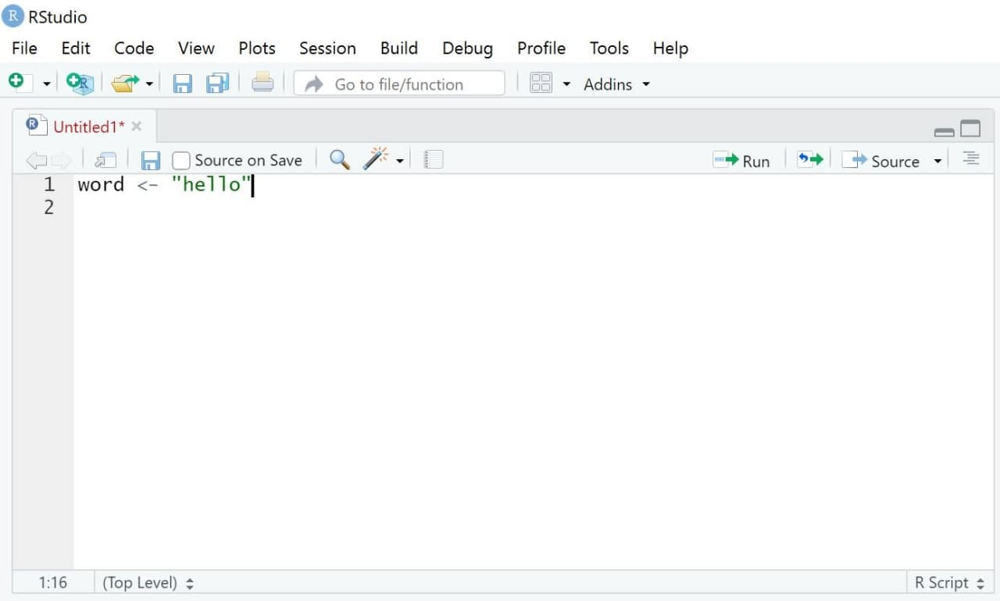
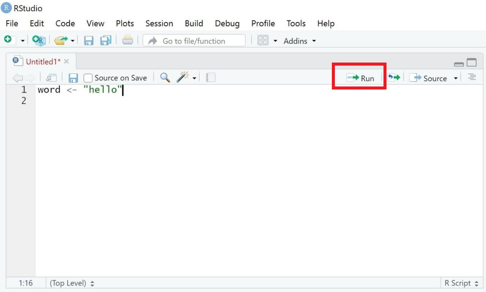
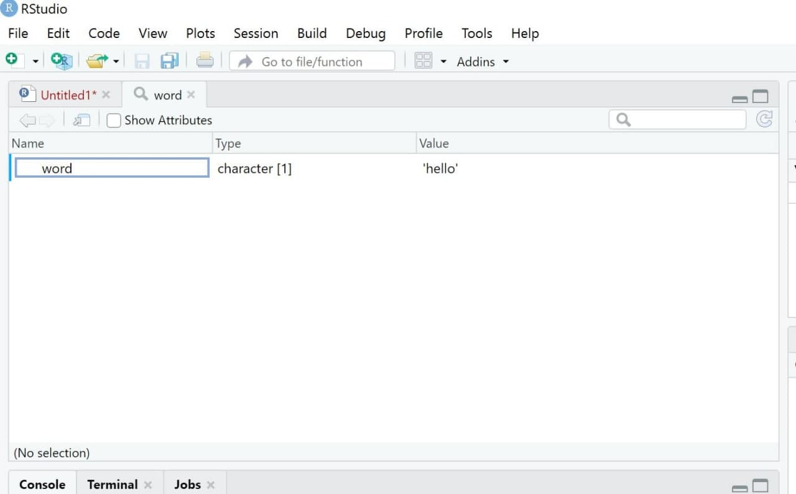

## 🎯 Learning goals

After working through Tutorial 2, you'll...

-   know what each window (panel) in RStudio does

## 1. What does each window in RStudio do?

RStudio is a graphical interface (an app) that makes it easier to work with R. It usually contains **four main windows (panels)**, each with a different purpose:

-   **Source (Script Editor):** Write and save your code. *Important:* After installing R/RStudio, you may not see this window right away. To open it, click *File → New File → R Script*.

-   **Console:** Run code. This is where commands are executed and results are shown.

-   **Environment:** View the objects you have created (e.g., datasets, variables, lists).

-   **Files / Plots / Packages / Help:** Manage files, view plots, install/update packages, and look up help pages.

*Image: Four main windows in RStudio*

{fig-alt="Overview of panels in RStudio"}

Your layout may look slightly different (panels can be arranged differently, and labels may vary). The four-panel setup shown here works well for many people, but feel free to adjust it. To change the layout, go to *Tools → Global Options → Pane Layout*.

*Image: Changing the layout*

{fig-alt="Changing the layout in RStudio"}

::: callout-tip
Want a more “hacky” look and feel like a coding pro? Go to *Tools → Appearance → Editor theme* and try a theme like **Chaos**.

In the options menu, you can also customize the editor—for example, you can enable **rainbow parentheses** via *Tools → Global Options → Code → Display*. This highlights matching parentheses in the same color, which can make code easier to read.
:::

## 2. Source: Write your own code

In the Source window, you write the code that tells R what task to perform.

### 2.1 Write code

Let’s start with a simple example. Suppose you want R to print the word `"hello"`.\
First, we create an **object** called *word* and assign the value `"hello"` to it.

Values are assigned to objects using either the operator `<-` or `=`. The **left side** contains the object name, and the **right side** contains the value that should be stored in that object. The following command tells R to assign the word `"hello"` to an object called *word*:

```{r,hello-1, eval = TRUE, echo = TRUE}
word <- "hello"
```

*Image: "Source"*

{fig-alt="Overview of the source panel in RStudio"}
R allows you to add comments to your code. This is helpful when you return to your script later—especially once your code becomes longer.

Comments are created using a hashtag `#`. Everything after `#` is ignored by R and treated as a note for humans only (so not run as code)

```{r, notes, eval = FALSE, echo = TRUE}
#this line of code assigns the word "hello" to an object called word
word <- "hello"
```

You can also use hashtags to structure your script into sections—similar to headings in a Word document.

If you add four hashtags before a heading `####`, RStudio creates a section header that helps you navigate through your script. This is especially useful for long files.

*Image: Structuring Code*

{fig-alt="Structuring code in RStudio"}

### 2.2 Execute Code

Next, we want to run (execute) our code.

1.  Select the line(s) of code you want to run.

2.  Click Run (top right of the Source window), or press:

-   Ctrl + Enter (Windows)

-   Cmd + Enter (Mac)

R will execute exactly the selected lines and create the object word. If no code is selected, only the current line (where your cursor is placed) will run.

*Image: Executing Code*

{fig-alt="Executing code in RStudio"}

Some commands take longer to run. If you notice an error while code is executing, you can stop it manually using the **Stop** button in the *Console* (visible only while R is running).

*Image: Interrupting R*

{fig-alt="Interrupting code in RStudio"} Else, you can use the menu via *Session / Interrupt R*.

Alternatively, use *Session → Interrupt R*.

### 2.3 Save Code

One major advantage of R is that analyses are reproducible—as long as you save your code. When you reopen RStudio, you can simply run the script again to reproduce your results.

To save your code:

-   Select *File → Save As…* (scripts must use the file ending `.R`), or

-   Click the Save button in the Source window and save your script, for example as `MyCode.R`.

{fig-alt="Saving code in RStudio"}

## 3. Console: Print results

The results of executed code appear in the **Console**, the second main window in RStudio. The Console shows both the commands you run and the output produced by R.

In the previous example, we created an object called *word* that stores the value `"hello"`.  
When we run code, R prints the executed command and—if requested—the content of the object in the Console.

For example, typing the object name and running the line will display its content:

```{r,hello-3, eval = TRUE, echo = TRUE}
word <- "hello"
word
```

*Image: Window "Console"*

{fig-alt="Console panel in RStudio"}

## 4. Environment: Overview of objects

The third window is the **Environment**. It shows all objects that currently exist in your R session—right now, that’s just the object *word*. As you create more objects (datasets, variables, results, etc.), this list will grow.

If you have worked with SPSS before, you can think of the Environment as a kind of *overview* of what is currently loaded. The key difference is that R can keep **many different objects at the same time**—for example, several datasets, models, or tables—so you can switch between them easily.

*Image: Window "Environment"*

{fig-alt="Environment panel in RStudio"} 

It’s important to know that you can visually inspect many objects (especially datasets) with the function `View()`. This opens the object in a new tab in the Source window. It may not feel very useful yet, but it becomes extremely helpful once you work with larger datasets that contain many observations (rows) and variables (columns).
```{r,hello-4, eval = FALSE, echo = TRUE}
View(word)
```

*Image: Window "View"*

{fig-alt="Viewing data in RStudio"} 

## 5. Plots/Help/Packages: Do everything else

Lastly, the standard RStudio interface includes a fourth window (depending on your chosen layout). In many setups, this panel contains tabs such as Files, Plots, Packages, and Help. We’ll cover these in more detail later. For now, it’s enough to know that this window is used, for example, to view plots and other output, browse files, and manage packages (including checking which packages are currently loaded).

*Image: Window "Files/Plots/Packages"*

{fig-alt="Files etc. panel in RStudio"} 

## 💡 Take-Aways {.unnumbered}

-   **Window "Source"**: used to write/execute code in R
-   **Window "Console"**: used to return results of executed code
-   **Window "Environment"**: used to inspect objects on which to use functions
-   **Window "Files/Plots/Packages etc."**: used for additional functions, for instance visualizations/searching for help/activating or updating packages
-   **Packages**: collections of topic-specific functions that extend the functions implemented in Base-R.

## 📚 More tutorials on this {.unnumbered}

You still have questions? The following tutorials & papers can help you with that:

-   [YaRrr! The Pirate's Guide to R by N.D.Phillips, Tutorial 2](https://bookdown.org/ndphillips/YaRrr/started.html)
-   [Computational Methods in der politischen Kommunikationsforschung by J. Unkel, Tutorial 1](https://bookdown.org/joone/ComputationalMethods/firststeps.html)
-   [Continuing education in R by Lara Kobilke, Tutorial 2](https://lkobilke.github.io/introduction_to_R/tutorial-installing-understanding-rr-studio.html)
-   [SICSS Boot Camp by C. Bail, Video 1](https://sicss.io/boot_camp#install)
-   [wegweisR by M. Haim, Video 1](https://youtu.be/p6f4oq08z48)
-   [R Cookbook by Long et al., Tutorial 1](https://rc2e.com/gettingstarted#recipe-id001)
