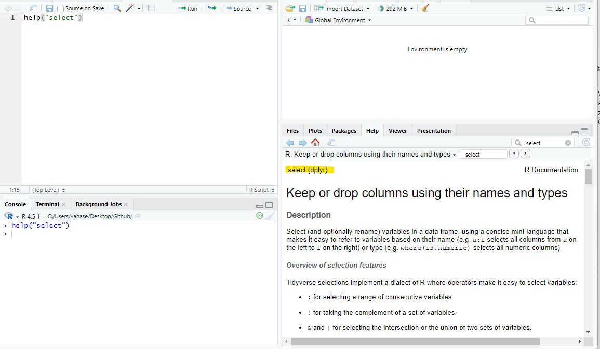
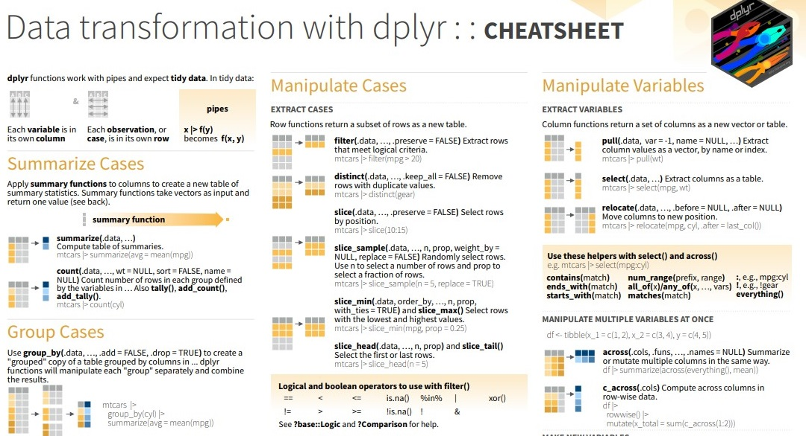

::: callout-note
## 🎯 Learning goals

After working through Tutorial 3, you'll be able to...

-   describe the basic workflow in RStudio (script → objects → functions → output)
-   explain what objects and functions are and use them in simple examples
-   explain what packages are and apply them by installing, loading, and using a package
-   apply these skills to create a simple R analysis for your own dataset
:::

## 1. Basic workflow in R

The basic workflow in R looks like this:

**🖥️ Setup**

-   [ ] Open the RStudio project
-   [ ] Check that the project is located in the correct folder and contains *data*, *scripts*, and *output* subfolders
-   [ ] If necessary, open the script for the tutorial (download via [Materials](81-materials.qmd)). **Note**: No script for tutorial 3!

**📦 Packages**

-   [ ] Install the required packages (if needed)
-   [ ] Load the required packages using `library()`

**🔎 Analysis**

-   [ ] Import or create your data
-   [ ] Run the analysis
-   [ ] Create outputs (e.g., tables, plots, or saved files)

**💾 Saving everything**

-   [ ] Save your code (and any edited data files, if applicable)

Check your set-up. Are you ready to go? 🚀

## 2. Object- and function-oriented programming

Before we start working with data, it is important to understand a core idea behind R:

R is an **object- and function-oriented programming language**.

Chambers (2014, p. 4) summarizes this idea nicely:

-   Everything that exists is an **object**.
-   Everything that happens is a **function call**.

These two principles explain most of what you will do in R.

### 2.1 Objects: storing information

In R, we store information inside **objects** so that we can work with it later.

An object can contain, for example:

-   a number\
-   a word or text\
-   multiple values\
-   a dataset\
-   results from an analysis

We create objects by **assigning** a value to a name using the assignment operator `<-`.

```{r,assigning,eval = TRUE, echo = TRUE}
word <- "hello"
```

This command creates an object called *word* and stores the text `"hello"` inside it.

### 2.2 Functions: doing something with objects

The second key idea is that almost everything in R happens through **functions**.

A function:

-   takes an input,
-   performs an operation,
-   returns an output.

General structure:

```{r,function,eval = FALSE, echo = TRUE}
function_name(input)
```

For example, functions can:

-   calculate,
-   transform data,
-   create plots.

Even assigning values with `<-` can be understood as part of R’s functional logic. Learning R therefore largely means learning **which functions to use and how to combine them**.

::: {.callout-tip collapse="true"}
## More on functions: Argument order and optional arguments

Functions in R use inputs called **arguments** (e.g., the variable you want to "give" a function for transformation or analysis).

**Argument order**

Many functions expect arguments in a specific order. If you provide arguments without naming them, R assumes you are following this predefined order.

General structure:

```{r,function-3,eval = FALSE, echo = TRUE}
function_name(argument1, argument2, argument3)
```

For example, the function `round()` rounds numbers:

```{r,function-4,eval = TRUE, echo = TRUE}
round(3.1413, 2)
```

The first argument is the number to round; the second argument specifies the number of digits.

If you change the order without naming arguments, the result may be wrong or produce an error. A safer and clearer approach is to **name arguments explicitly**:

```{r,function-4b,eval = TRUE, echo = TRUE}
round(x = 3.1413, digits = 2)
```

**Optional arguments**

Many functions also contain **optional arguments**. These arguments already have **default values**, meaning you only need to specify them if you want to change the default behavior.

For example, this works exactly the same as the code above:

```{r,function-5,eval = FALSE, echo = TRUE}
round(3.1413)
```

By default, `round()` uses digits = 0, so the result is rounded to a whole number. If you want a different behavior, you provide the optional argument:

```{r,function-6,eval = FALSE, echo = TRUE}
round(3.1413, 3)
```
:::

### 2.3 Take-Away and Example

To recap:

-   data and results are stored as **objects**
-   all operations are performed using **functions**
-   analysis consists of applying functions to objects step by step

Fortunately, R already provides many predefined functions, so you usually **use existing functions** rather than writing your own from scratch.

Let's take an example: Suppose we want to add more text to our object *word*. We can use the function `paste0()`, which combines pieces of text.

```{r,function-2,eval = TRUE, echo = TRUE}
word <- paste0(word, " and good morning")
word
```

What happens here?

1.  R takes the existing object *word* as input.
2.  The function `paste0()` combines it with new text.
3.  The result replaces the old object *word*.

This process — applying functions to objects and saving the result — is the basic workflow of programming in R.

## 3. Packages

R already comes with many built-in functions (called **Base R**).

However, for many tasks — such as data visualization, web scraping, or advanced data management — we need additional tools.

👉 **Packages are collections of functions, data, and documentation that extend the functionality of Base R.**

You can think of packages as *toolboxes*: each package provides tools designed for a specific purpose.

In the spirit of open science, anyone can develop and publish R packages, and the source code is openly available. This allows researchers and developers worldwide to share methods and improve existing tools.

A complete list of available R packages can be found on [CRAN](https://cran.r-project.org/web/packages) (the *Comprehensive R Archive Network*).

In this seminar, we'll for instance use packages like `tidyverse`, which provides tools for data import, cleaning, transformation, and visualization.

### 3.1 Install packages

Before you can use a package, you must **install** it on your computer. Installation downloads the package from CRAN and saves it locally.

For example, to install the `tidyverse` package, run:

```{r,install,eval = FALSE, echo = TRUE}
install.packages("tidyverse")
```

You only need to install a package once per computer (unless you reinstall R or update packages).

### 3.2 Load packages

After installation, you must **load** the package in **every new R session** before using its functions. This is done with the `library()` function:

```{r, load-package, eval = FALSE, echo = TRUE}
library("tidyverse")
```

👉 **Important distinction**

-   `install.packages()` → done once
-   `library()` → done every time you start R

### 3.3 Getting help and information about packages

After installing and loading a package, you may want to learn what it can do.

Packages usually include:

-   Help files for individual functions
-   a reference manual (list of all functions)
-   vignettes (long-form tutorials written by the package authors)

Helpful commands in R:

-   `help(package = "tidyverse")` — overview of a package\
-   `?select` — help page for a function

You can also visit the package’s CRAN page (e.g., search *CRAN tidyverse* in Google). There you will find descriptions, documentation, and tutorials explaining how the package is used.

## 4. How to (not) ask for help (featuring ChatGPT)

One thing you can count on in this seminar: **many things won’t work right away**.

You will forget commands, mix up function names, use the wrong object type, misspell package names, or run into error messages you don’t understand. This happens to everyone — from beginners to people who have used R for years.

If you did not understand something in a tutorial or just want me to repeat something: Please *do* ask! The most important thing when learning R is to understand that it is **completely normal to feel lost sometimes**. Don't worry - it's highly likely that everyone else feels the same.

When something breaks and I am not around to help:

1.  Check your code and object names carefully.
2.  Read the error message.
3.  R’s built-in help system (`help` and `?`)
4.  Search online with good keywords
5.  Ask for help in a reproducible way (code + error + context), for example in our [GitHub discussion forum](https://github.com/media-methods/programming-with-r/discussions).

### 4.1 Use R’s built-in help system

If you want information about a package, use `help()` or `?`. These commands open documentation in the Help pane in RStudio.

```{r, activate2, eval = FALSE, echo = TRUE}
help(package = "quanteda") # Version 1 of asking for help
?quanteda # Version 2 of asking for help
```

Similarly, you can check for help for a specific function. Let's assume I am not sure what the `select()` function does in R. I could check this out in R Studio:

{fig-alt="Help function RStudio"}

### 4.2 Read error messages (look scary but are helpful!)

Error messages often look annoying, but they usually contain useful clues:

-   which function failed
-   where it failed
-   what R expected vs. what it got

A good habit is to:

-   read the full message
-   identify the function name mentioned
-   copy the message when asking for help

### 4.3 Search for help online (smart Googling)

For some questions, using the `help()` function won't cut it. In this case, **Google is your new best friend**.

Good sources for R help:

-   [Stack Overflow](https://stackoverflow.com/questions/tagged/r)
-   [StackExchange](https://stats.stackexchange.com/?tags=r)
-   [RSeek](https://rseek.org)
-   ChatGPT

::: callout-warning
## ⚠️ Critical: Do NOT use ChatGPT before Session 6

Do **not** use ChatGPT before Session 6, that is, after we have finished repeating the basics.

If you rely on ChatGPT while you are still learning the basics, you will not build the foundational skills you need — and I can be very direct about the consequence: **you will fail the exam**.

ChatGPT is **not allowed** in the exam. The exam requires that you can write and debug basic R code **on your own**. If you skip that learning phase now, you will be lost later and you will not be able to keep up with the course.

Until Session 4, you must learn by:

-   working through the tutorial material step by step,
-   using the built-in help system (help, ?),
-   reading error messages carefully,
-   asking me or your peers when you’re stuck.
:::

***Use good search terms***

Include at least:

-   the function name
-   the exact (or partial) error message
-   the term “R” (so results are for the right programming language)

***Don't trust every result you get***

While most Google searches will get you a multitude of different answers for your questions, not all of them are necessarily right for your specific problem. Often, there are different solutions for the same problem - so don't be confused when people are proposing different approaches. Its often best to scroll through some search results and then try the solution that seems most understandable and/or suitable for you.

***Make your problem reproducible***

If you ask others for help (online, classmates, instructor, or ChatGPT), they need to be able to reproduce the problem.

This is a bad help request: "*If I try to set my working directory, I get an error. What is the problem?*"

A good help request includes:

-   the exact code you ran
-   the exact error message
-   your operating system (Windows/Mac/Linux)
-   ideally your session information, with `sessionInfo()`

Example of a better request: "*I am using Windows. I ran this code: setwd(C:*\Users\Admin\Documents). R returns: Error: unexpected input in setwd(C:. What am I doing wrong?"

I recommend [this book chapter](https://r4ds.hadley.nz/workflow-help.html) by Wickham et al for a detailed discussion.

## 5. Save code & results

Imagine that you have done your analysis. Now, we want to save our results!

### 5.1 Save your code

One of the biggest advantages of working in R is **reproducibility**: if you save your code, you (and others) can rerun it later and reproduce the same results.

That only works if you actually save your scripts.

To save code, you have two options. Remember to save your scripts in the folder *scripts*:

-   Use the menu option *File → Save As* …\
    Important: scripts should be saved with the file ending .R

-   Click the Save button in the Source pane and save your script, for example as MyCode.R

{fig-alt="Saving code in R"} \### 5.2 Save your results

You have successfully executed all commands and now want R to save your results/working environment? Saving your results is especially useful if it takes some time to have R run through the code and reproduce results - in this case, you only need to save results once and can then load them for the next session.

Again, there are several options for saving your results. Remember to save them in the folder *output/results*:

-   Use the `save.image()`-command:

```{r, save, eval = FALSE, echo = TRUE}
save.image("output/results/tutorial3.RDATA")
```

-   Use the *save*-button in the *environment* window and save your results in the correct format, for instance as MyData.RDATA".

{fig-alt="Saving code in R"}

## 💡 Take-Aways

-   **Packages**: Collections of topic-specific functions that extend the functions implemented in base R. You only need to install them once on your computer - but you have to load packages at the beginning of each session. Otherwise, R will not be able to find related functions. Commands: `install.packages()`, `library()`
-   **Help**: The thing everyone working with R needs. It's normal to run into errors when working with R - don't get frustrated too easily. Commands: `?`, `help()`
-   **Save code & results**: You should save your code/results from time to time to be able to replicate analyses. Commands: `save.image`

## 🤓 Smart Hacks

::: {.callout-tip collapse="true"}
## Smart Hack 1: Using `::` to call functions

Once a package is loaded, its functions can be used directly. Alternatively, you can call a specific function without loading the entire package using the `::` operator. For example, you may want to use a **single function** from a package without loading the whole package with `library()`.

Here, we use the `select()` function from the `dplyr()` package even without loading the package first.

```{r, use, eval = FALSE, echo = TRUE}
dplyr::select()
```

This approach is useful when you only need one function or multiple packages contain functions with the same name.
:::

::: {.callout-tip collapse="true"}
## Smart Hack 2: 🧾 Cheatsheets

Cheat sheets are one-page summaries of the most important functions and patterns in R (e.g., `dplyr`, `ggplot2`, etc.). They’re great when you *roughly* know what you want to do but don’t remember the exact command.

Where to find them:

-   **In RStudio:** *Help* → *Cheatsheets* (opens a list you can download as PDFs)

**Example of a Cheatsheet**

{fig-alt="Using Cheatsheets in R"}
:::

## 🎲 Quiz

::::::: {.content-visible when-format="html"}


::: {.callout-note icon="false"}
## 🎲 Question 1

**Which of the following statements about functions and objects are correct?**

```{ojs}
//| echo: false

MC_objects_functions_1 = [
    ["In R, objects are used to store information such as numbers, text, or datasets.", "True"],
    ["The assignment operator = can be used to assign values to objects.", "True"],
    ["A function takes an input, performs an operation, and returns an output.", "True"],
    ["Everything that happens in R can be understood as a function call.", "True"],
    ["No function can have the same name as another function in another package.", "False"]
]

viewof answers_objects_functions_1 = quizInput({
  questions: MC_objects_functions_1,
  options: ["True", "False"]
})
```
:::

::: {.callout-note icon="false"}
## 🎲 Question 2

**Which of the following statements about packages are correct?**

```{ojs}
//| echo: false

MC_packages_1 = [
    ["Packages are collections of functions that extend Base R.", "True"],
    ["I need to install a package every time I start R.", "False"],
    ["After installing a package once, I usually load it using library() in each session.", "True"]
]

viewof answers_packages_1 = quizInput({
  questions: MC_packages_1,
  options: ["True", "False"]
})
```
:::

::: {.callout-note icon="false"}
## 🎲 Question 3

**We want to get the mean value of "age". Try to run the following code. It will throw an error message. Post in [this GitHub forum](https://github.com/media-methods/programming-with-r/discussions/3) to ask for help. Think about making your problem reproducible!**

```{r, question3, eval = FALSE, echo = TRUE}
age <- c(1, 4, 7, 8, NA, 0, 3, 6)
mean(age)
```
:::

::: {.callout-note icon="false"}
## 🎲 Question 4

**Run the following code. Why does it not create an object called "days" in the Environment pane**?

```{r, question4, eval = FALSE, echo = TRUE}
c("Monday", "Tuesday", "Wednesday", "Thursday", "Friday")
```
:::

## 📚 More tutorials on this

You still have questions? The following tutorials & papers can help you with that:

-   [R for Data Science by Wickham et al.](https://r4ds.hadley.nz/)
-   ["wegweisR" by M. Haim, Video 1](https://youtu.be/p6f4oq08z48)
-   ["R Cookbook" by Long et al., Tutorial 1](https://rc2e.com/)
-   ["Tutorial 2 - Wissen macht R" by B. Fretwurst](https://ikmz.pages.uzh.ch/Wissen-macht-R/01-Basics.html)
