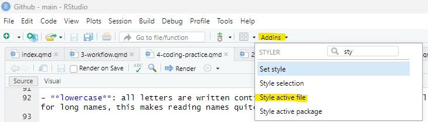

::: callout-note
## 🎯 Learning goals

After working through Tutorial 4, you'll be able to...

-   explain the difference between baseR and the tidyverse
-   explain and use the pipe (`|>`) to connect steps in a workflow
-   explain and apply good coding practices
:::

## 1. Base-R vs. tidyverse

When working with R, you will often encounter two main approaches to writing code:

- **Base R**
- **the tidyverse**

Both approaches are valid and widely used [(see this overview for a comparison)](https://towardsdatascience.com/tidyverse-vs-base-r-how-to-choose-the-best-framework-for-you-29b702bdb384). Understanding the difference helps you read other people’s code and develop a consistent coding style yourself.

**Base R**

Base R includes all functions that are available immediately after installing R.  
You do not need to install additional packages to use Base R functionality.

Many online examples, older tutorials, and forum discussions use Base R.  
For this reason, it is useful to recognize Base R syntax even if you do not primarily use it yourself.


**The tidyverse*

The*tidyverse is a collection of additional packages designed for data science workflows. It was developed by Hadley Wickham and collaborators at Posit (formerly RStudio).

The tidyverse provides:

- consistent function naming
- readable and structured workflows
- tools for data import, transformation, visualization, and analysis
- a shared philosophy for organizing data and code

Many beginners find tidyverse code easier to read because commands follow a consistent grammar and style.

In this course, we will primarily work with the tidyverse.

## 2. The pipe in tidyverse


## 3. Coding style

Writing code that *works* is important — but writing code that is *readable and understandable* is just as important. This is called **good coding style**.

Or, as Wickham et al. ([2025](https://r4ds.hadley.nz/workflow-style.html)) put it "*Good coding style is like correct punctuation: you can manage without it, butitsuremakesthingseasiertoread.*"

Good coding style helps you:

- understand your own code later,
- find and fix errors more easily,
- collaborate with others,
- make your analyses reproducible.

In this course, we follow the the [tidyverse style guide](https://style.tidyverse.org).

### 3.1 Use clear object names

Choose names that describe what the object contains.

Good examples:

- student_age
- survey_data
- mean_income

Avoid unclear names like:

- x
- data1
- temp

### 3.2 Use a consistent naming convention style

Names for objects or functions cannot contain blank spaces. Please also avoid special signs (e.g., *!* or *?*). Apart from these, a few naming convention styles exist:

- **snake_case** 🐍:  words are separated using an underscore `_`. This is the preferred naming style in the tidyverse and the main style used in this course. Example: `data_survey`.

- **ant.case**: words are separated using a dot `.`. This style appears frequently in Base R scripts. Example: `data.survey`.

- **camelCase**: each new word starts with a capital letter (except the first word). This style appears frequently in Base R scripts. Example: `dataSurvey`.

- **lowercase**: all letters are written continuously without separators. Especially for long names, this makes reading names quite hard. Example: `datasurvey`. 

Different styles exist because R developed over many years with contributions from many programmers.

In this course:

- ✅ Use **snake_case** for your own objects and variables.
- 👀 Learn to **recognize** other styles when reading existing R code.

::: {.callout-tip collapse="true"}
## Smart Hack: Using the `styler` package
Install the [styler package](https://styler.r-lib.org/index.html) by Kirill Müller and colleagues,. If you then click on Addins at the top of your R Studio and select, for example, "*Style active file*", the package will set your coding style to snake_case.

{fig-alt="Styling code with the styler package"}

:::


### 3.3 Add spaces around operators

Spaces make code easier to scan visually. Compare the following codes:

Bad example:
```{r,coding-style-1,eval = TRUE, echo = TRUE}
number<-5+3
```

Good example:
```{r,coding-style-2,eval = TRUE, echo = TRUE}
number <- 5 + 3
```

### 3.4 Comment your code

Comments explain *why* you are doing something. Good comments help future-you understand past-you. Comments start with `#`:

```{r,coding-style-3, eval = FALSE, echo = TRUE}
# calculate mean age while excluding missing values
mean(age, na.rm = TRUE)
```
 
## 🎲 Quiz

:::: {.content-visible when-format="html"}


::: {.callout-note icon=false}
## 🎲 Question 1

**Why does the following code not work? (Try running it)**
```{r, quiz-4,eval = FALSE, echo = TRUE}
days_week <- c("Monday", "Tuesday", "Wednesday", "Thursday", "Friday")
days_Week
```
:::