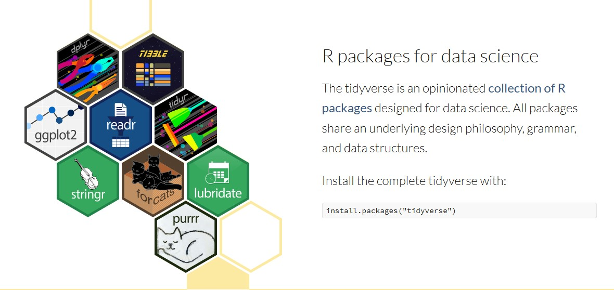

::: callout-note
## 🎯 Learning goals

After working through Tutorial 5, you'll be able to...

-   Explain and apply the tidyverse data-pipeline workflow (using `|>`)
-   Analyze and produce tidy data (e.g., via `select()`, `filter()`, `mutate()`, etc.)
:::

## 1 The tidyverse

The [tidyverse](https://www.tidyverse.org) is a popular ecosystem of R packages designed for data science workflows. It is especially accessible for those just learning R because its functions are consistent and work well together.

The tidyverse includes packages for common tasks:

-   `tibble`: modern data frames (tibbles) that print nicely and work smoothly in pipelines
-   `readr`, `haven`, `readxl`: importing data (CSV, SPSS/Stata/SAS, Excel)
-   `dplyr`, `tidyr`: data wrangling (filtering, selecting, transforming, reshaping)
-   `stringr`, `forcats`, `lubridate`: working with strings, factors, and dates/times
-   `purrr`: functional programming helpers (iterate safely and clearly)
-   `ggplot2`: plotting with the grammar of graphics

{fig-alt="Overview of the tidyverse"} 

To install and load the core tidyverse packages:

```{r inst-tidyverse, eval=FALSE, echo=TRUE}
install.packages("tidyverse")
library(tidyverse)
```

For deeper reading and examples, I recommend Wickham et al's book [*R for Data Science*](https://r4ds.hadley.nz/) - it is just fantastic! 👏

### 1.1 Tibbles and tidy data

The tidyverse commonly uses **tibbles**, a modern variant of the data frame. Tibbles are simply a friendlier way to store and print tabular data.

Many tidyverse tools work best when your dataset follows **tidy data principles**:

-   Columns: each column is one variable
-   Rows: each row is one observation
-   Cells: each cell is one value

*Image: Tidy data structure (Source: R for Data Science, Figure 5.1)*\


Let's check an example: We will use the `WoJ` dataset. It contains a quantitative survey of N = 1,200 journalists from five countries, collected via the World of Journalism study. The data is provided via the [`tidycomm`](https://cran.r-project.org/web/packages/tidycomm/index.html) package developed by Unkel et al.

First, we retrieve the data and save it as an object named `data_woj`. Next, we use the `as_tibble()` command which essentially prints our data in a nicer format. The data does not change, we just get additional information (such as the type of data it contains).

Make sure to have the `tidycomm` and the `tidyverse` package installed before running this command!

```{r woj-load, eval= TRUE, echo=TRUE, warning=FALSE, message=FALSE}
# we load the necessary packages
library(tidycomm)
library(tidyverse)

# loads the WoJ dataset shipped with tidycomm
data_woj <- tidycomm::WoJ

# we inspect the data
data_woj |>
  as_tibble()
```

If we only want to inspect the first rows in our data set, we can use the `head()` command:

```{r woj-head, eval= TRUE, echo=TRUE, warning=FALSE, message=FALSE}
data_woj |>
  as_tibble() |>
  head()
```

### 1.2 Pipes for readable workflows

A tidyverse workflow is typically written as a **pipeline**: you start with a dataset, then apply a sequence of data transformation steps.

In this tutorial, we use the **base R pipe** `|>`, which is built into modern R. You actually saw the pipe in the previous line of commands!

Conceptually, `|>` means:

> “Take the object on the left and pass it as the first argument to the function on the right.”

In the code before, we...

-   took the object `data_woj`
-   pushed it into the pipe `|>`
-   and then transformed it to a tibble using `as_tibble()`
-   and then only inspect the first observations using `head()`

```{r data-tibble-pipe, eval=FALSE, echo=TRUE}
data_woj |>
  as_tibble() |>
  head()
```

::: {.callout-warning collapse="true"}
## If the pipe `|>` does not work

The pipe `|>` requires R 4.1.0 or newer. If the code does not work, you have to update R.

You may also see the older `tidyverse`/`magrittr` pipe `%>%` in other tutorials and older code. It does the same basic thing: it takes the object on the left and passes it into the function on the right. The main differences are:

-   `|>` is base R (recommended for new code; no extra package needed).

-   `%>%` comes from magrittr (loaded automatically via `tidyverse`).
:::

**Saving the result of pipes**

**Remember:** If you want to keep a result, you must assign it to an object. For example, if we want to save `data_woj` as a tibble, we need to assign the result. For example, we could overwrite our existing object using the `<-` operator:

```{r data-tibble-2, eval=FALSE, echo=TRUE}
data_woj <- data_woj |>
  as_tibble()
```

**What is in my pipe?**

When you write pipelines, you only need to specify the input object **once** — at the beginning of the pipe. After that, R passes the result forward step by step. This usually makes code easier to read.

For example, this code is easy to understand:

```{r data-pipe-example, eval=FALSE, echo=TRUE}
data_woj |>
  as_tibble() |>
  select(country, work_experience) |>
  filter(work_experience > 10)
```

This code does the same, but uses more separate lines and is harder to read - underlining why we prefer the `|>`:

```{r data-pipe-example2, eval= FALSE, echo=TRUE}
data_woj <- as_tibble(data_woj)
data_woj <- select(data_woj, country, work_experience)
data_woj <- filter(data_woj, work_experience > 10)
```

## 2 Data management with dplyr

The `tidyverse` has a great package for data wrangling: `dplyr`.

Among the most important `dplyr` functions we will use in this class are:

-   `select()`: choose columns (variables) by name
-   `filter()`: keep rows (observations) that match conditions
-   `arrange()`: sort rows in ascending or descending order
-   `mutate()`: create new columns or overwrite existing ones, for example using `if_else()` and `case_when()`

### 2.1 Select variables

You will frequently encounter large datasets with many variables. `select()` helps you narrow the dataset down to the columns you actually need.

Let’s reduce the object `data_woj` to the variables `country` and `work_experience` using `select()`:

```{r, select, eval = TRUE, echo = TRUE}
# select specific variables
data_woj_reduced <- data_woj |>
  select(country, work_experience) 
```

The result looks like this:

```{r, select-2, eval = TRUE, echo = TRUE}
data_woj_reduced |>
  head()
```

You can also remove columns using the `-` symbol. This means: "select everything **except** the column(s) named here".

Another example: We deselect `country` and `work_experience` (without overwriting `data_woj_reduced`).

```{r, select-3, eval = TRUE, echo = TRUE}
data_woj |>
  select(-country, -work_experience) |>
  head()
```

**Remember:** `select()` does not change your original dataset unless you assign the result with `<-`.

### 2.2 Filter observations

Before, `select()` selects (or deselects) **columns** (variables). In contrast, `filter()` selects (or deselects) specific **rows** (observations).

Let’s include those observations from `data_woj_reduced` where respondents have been working in journalism for longer than 10 years according to `work_experience`:

```{r, filter, eval = TRUE, echo = TRUE}
data_woj_reduced |>
  filter(work_experience > 10) |>
  head()
```

We can build more complicated filters. Let’s only include respondents with **more than 10 years** of experience **and** from Austria according to `country`:

```{r, filter-2, eval = TRUE, echo = TRUE}
data_woj_reduced |>
  filter(work_experience > 10, country == "Austria") |>
  head()
```

For data wrangling, you will often use logical operators such as `>`, `==`, `&`, and `|`.

Logical operators can be used to check whether certain statements are true/false, whether some values take on a certain value or not, etc. Since we won't need this right away, I won't go into details here - but we will need these later:

```{r, logical-operators, eval=TRUE, echo=FALSE}
Operator <- c("TRUE", "FALSE", "&", "|", "==", "!=", ">", "<", ">=", "<=")
Meaning <- c(
  "indicates that a certain statement applies, i.e., is true",
  "indicates that a certain statement does not apply, i.e., is not true",
  "connects two statements which should both be true (AND)",
  "connects two statements of which at least one should be true (OR)",
  "indicates that a certain value should equal another one",
  "indicates that a certain value should not equal another one",
  "indicates that a certain value should be larger than another one",
  "indicates that a certain value should be smaller than another one",
  "indicates that a certain value should be larger than or equal to another one",
  "indicates that a certain value should be smaller than or equal to another one"
)
Table <- data.frame(Operator = Operator, Meaning = Meaning)
knitr::kable(Table, booktabs = TRUE, caption = "Logical / comparison operators")
```

::: {.callout-warning collapse="true"}
## `=` vs. `==`

In R, `=` and `==` do **different jobs**:

Use `=` to assign or set an argument value. With the following code, we ask R to find the maximum value of `work_experience`. In the function `max`, we set the argument `x` (the data) to `work_experience` and ignore missing values with `na.rm` (more on this later).

```{r, equal1, eval = FALSE, echo = TRUE}
max(x = data_woj_reduced$work_experience, na.rm = TRUE)
```

Use `==` to test equality (a logical comparison). With the following code, we ask R to find those cases in `data_woj_reduced`, where `work_experience` equals 20 (so respondents have worked for 20 years).

```{r, equal2, eval = FALSE, echo = TRUE}
data_woj_reduced |>
  filter(work_experience == 20)
```
:::

### 2.3 Arrange data

`arrange()` changes the order of observations (rows). By default, `arrange()` sorts in ascending order (smallest to largest; A to Z). To sort in descending order, use `desc()`.

Let's sort respondents by working experience (ascending):

```{r, arrange-ascending, eval = TRUE, echo = TRUE}
data_woj_reduced |>
  arrange(work_experience) |>
  head()
```

... and now descending:

```{r, arrange-descending, eval = TRUE, echo = TRUE}
data_woj_reduced |>
  arrange(desc(work_experience)) |>
  head()
```

### 2.4 Change values

Often you want to add new columns (e.g., compute a new variable) or recode existing values.\
With `mutate()`, you can **create** new columns or **overwrite** existing ones.

A tidyverse-style approach for recoding is to combine `mutate()` with:

-   `if_else()` for simple two-category recodes
-   `case_when()` for multiple conditions/categories

Important: `case_when()` does not “change values by itself” — it **returns a new vector**. You change a dataset only when you assign the result to a column (e.g., inside `mutate()`).

For example, we can create a new, categorical variable `work_experience_cat` that describes whether respondents have 5, 10 or more years of work experience. Note that we use the `%in%` operator to define whether `work_experience` takes on a specific value (e.g., `1:5`, meaning 1, 2, 3, 4, or 5). All other values are set to `NA` (more on this later).

```{r,mutate, eval = TRUE, echo = TRUE}
data_woj_reduced |>
  mutate(
    work_experience_cat = case_when(
      work_experience %in% 1:5 ~ "max. 5 years",
      work_experience %in% 6:10 ~ "6 to 10 years",
      work_experience > 10 ~ "more than 10 years",
      TRUE ~ NA_character_)) |>
  head()
```

## 💡 Take-Aways

-   **pipe** data for subsequent transformation: `|>`
-   **view** only selected variables: `head()`
-   **select** variables: `select()`
-   **filter** observations: `filter()`, often using operators like `>`, `==`, `&`, `|`, and `%in%`
-   **arrange** data: `arrange()`
-   **transform** values: `mutate()`, `if_else()`, and `case_when()`

## 🤓 Smart Hacks

::: {.callout-tip collapse="true"}
## Smart Hack 1: Selection helpers

So far, we’ve only worked with a few variables. With larger datasets, this quickly becomes impractical because you often need to select or transform many columns at once. The tidyverse solves this with **tidy selections** (via *tidyselect*): you can select columns based on their names, patterns, or properties, using so-called **selection helpers**.

Common helpers include:

-   `contains()`: selects columns whose names contain a specific string (e.g., `contains("_")`)
-   `starts_with()`: selects columns whose names start with a string (e.g., `starts_with("work")`)
-   `ends_with()`: selects columns whose names end with a string (e.g., `"experience"`)
-   `where()`: selects columns for which a function returns `TRUE` (often used to select by type, e.g. `where(is.numeric)`)

For example, we can retrieve all variables containing the term "ethics":

```{r, use, eval = FALSE, echo = TRUE}
data_woj |>
  select(contains("ethics"))
```
:::

## 🎲 Quiz

:::::: {.content-visible when-format="html"}


::: {.callout-note icon="false"}
## 🎲 Question 1

**Which of the following statements about the pipe `|>` are correct?**

```{ojs}
//| echo: false

MC_pipe_1 = [
  ["`|>` passes the result on the left into the first argument of the function on the right.", "True"],
  ["A pipe should always end on the `|>` symbol.", "False"],  
  ["In a pipeline, you only need to specify the dataset once at the beginning.", "True"],
  ["`data |> head()` and `head(data)` return different results.", "False"]
]

viewof answers_objects_functions_1 = quizInput({
  questions: MC_pipe_1,
  options: ["True", "False"]
})
```
:::

::: {.callout-note icon="false"}
## 🎲 Question 2

**Which of the following statements about the tidyverse are correct?**

```{ojs}
//| echo: false

MC_combined_tidyverse_1 = [
  ["`select()` is used to choose columns (variables).", "True"],
  ["`filter()` changes the original dataset even if you do not assign the result.", "False"],
  ["`=` and `==` always mean the same thing in R.", "False"],
  ["`mutate()` can create a new column or overwrite an existing column.", "True"],
  ["`select(-country)` removes all rows where country is missing.", "False"]
]

viewof answers_combined_tidyverse_1 = quizInput({
  questions: MC_combined_tidyverse_1,
  options: ["True", "False"]
})
```
:::

::: {.callout-note icon="false"}
## 🎲 Question 3

**You only want to retrieve the variables "reach" and "country". Type in the correct command!**

(Choose among: select, filter, count oder mutate)

```{ojs}
//| echo: false

TRT_5_1 = [
  `data_woj |> 
        {{input}}(reach, country)`, // Text
  "Command", // Placeholder
  "select", // Correct Text
  "monospace", // Font Family
  "#000000" // Color
];

viewof answer_TRT_5_1 = textReplacementWithText({
  text: TRT_5_1[0],
  placeholder: TRT_5_1[1],
  correctText: TRT_5_1[2],
  fontFamily: TRT_5_1[3],
  color: TRT_5_1[4]
});
```
:::

## 📚 More tutorials on this

You still have questions? The following tutorials & papers can help you with that:

-   [dplyr cheatsheet](https://rstudio.github.io/cheatsheets/data-transformation.pdf)
-   [R for Data Science by Wickham et al.](https://r4ds.hadley.nz/)
-   ["Wissen macht R" by B. Fretwurst](https://ikmz.pages.uzh.ch/Wissen-macht-R/01-Basics.html)

## 📌 Test your knowledge

### Task 1 (Easy🔥)

Use the `WoJ` data. Find out how many variables describe journalistic trust!

### Task 2 (Medium🔥🔥)

Using the same data, reduce the data set to journalists who...

-   live in Austria
-   are employed full-time or part-time
-   have high trust in the government (values 4 or 5)

*How many journalists fulfill these criteria?*

### Task 3 (Hard🔥🔥🔥)

Using the full `WoJ` data, save the data as `woj_transformed` and:

-   create a new variable "ethics_cat" that takes on the value "high" if a journalists scores a 5 for any of the variables `ethics_1`, `ethics_2`, `ethics_3`, or `ethics_4` and "low" otherwise.
-   reduce the data set to journalists not working as freelancers (see variable `employment`).

*What is the mean amount of years, according to the variable `work_experience`, journalists in `woj_transformed` have worked?*

*From which country is the journalist with the most years of work experience?*
::::::
