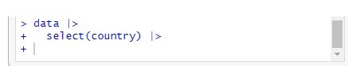

## Question 1: R cannot find a package

When running this command...
```{r}
#| eval: false
library(tidyverse)
```

I get this error: "*Error in library(tidyverse) : there is no package called ‘tidyverse’"*

**Solution:**
This simply means that the `tidyverse` package is not installed yet on your computer. In R, installing (done *once*) and loading a package (done *every time* you re-open R) are two different steps.
```{r}
#| eval: false

#first (one!)
install.packages("tidyverse")

#second (every time you open R!)
library(tidyverse)
```

## Question 2: My computer is stuck on a pipe

When running this command...
```{r}
#| eval: false
data |>
  select(country) |>
```

... my computer does not react anymore. It seems that the code is running forever. My console also seems weird as it still shows the code and not an error:



**Solution:**
The problem is simply that the pipe is unfinished. Your code end with a pipe operator `|>`, so R is still "waiting" for the next command it should apply. 

A pipe `|>` should never be the last thing on a line unless another command follows on the next line. Interrupt R by pressing `|>`.
```{r}
#| eval: false

#first (one!)
install.packages("tidyverse")

#second (every time you open R!)
library(tidyverse)
```
