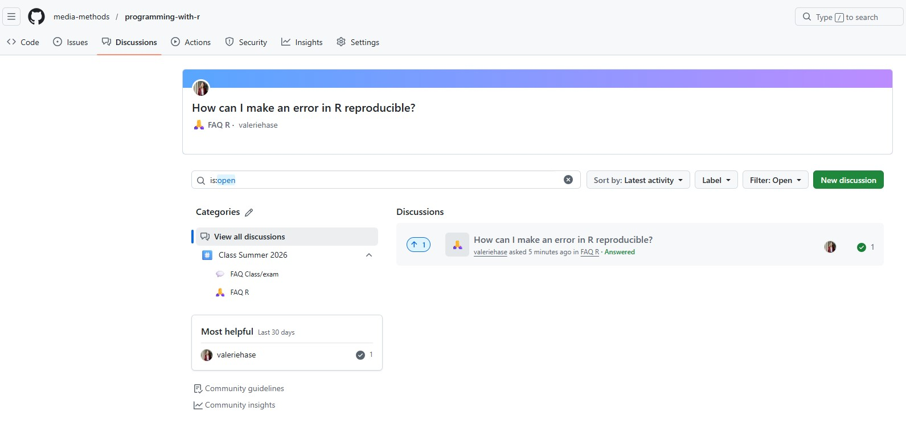

[]{#sec-84-forum}

### GitHub Discussion Forum

You can ask questions, report issues, or participate in discussions on GitHub:

👉 <https://github.com/media-methods/programming-with-r/discussions>

[{fig-alt="Screenshot of the Github Discussion forum"}](https://github.com/media-methods/programming-with-r/discussions)
