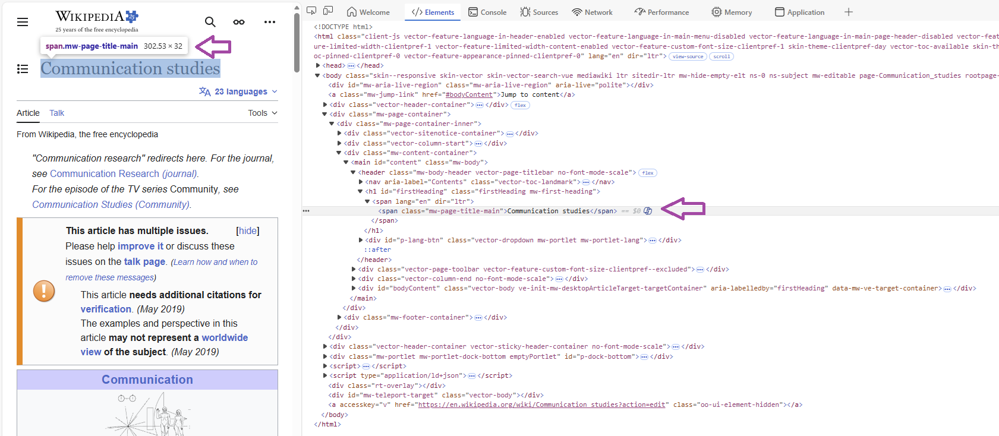

::: callout-note
## 🎯 Learning goals

After working through Tutorial 10, you'll be able to...

-   **explain** web scraping, including ethical and legal limitations
-   **explain** the basics of CSS and HTML
-   **apply** functions for web scraping
:::

## 1. What is web scraping?

I understand web scraping as the *automated collection and retrieval of relevant data from website code*. Generally, this includes at least three steps:

1.  Identify the URL of the website you want to scrape

2.  Download its content

3.  From downloaded data, separate „junk“ from relevant data

Since a lot of social media platforms have closed automated access to their data via Application Programming Interfaces (APIs), researchers increasingly have to collect data via other methods.

As a data collection method, web scraping has several advantages:

-   It allows us to collect data that may otherwise not be available for research
-   It allows us to collect new (meta) data (e.g., timestamps of content, multi-modal data)
-   It allows us to rely on the structuredness of websites to scale-up data collection

## 2. Ethical, legal, and technical limitations

While web scraping has some advantages, these go hand in hand with several ethical, legal, and technical limitations. For excellent and far more detailed overviews on all of these points, see this overview article by [Luscombe et al., 2022](https://link.springer.com/article/10.1007/s11135-021-01164-0) and [Brown et al., 2025](https://doi.org/10.1177/20539517251381686). Some of these legal points need to be re-considered based on the DGPR [Borg et al., 2026](https://doi.org/10.1080/13600869.2026.2654231).

-   **Ethically**, researchers should ask: *Should I scrape this website?* For example, is this data public or private? Does it contain information by individuals and/or could this information be used to harm specific individuals? Do I need to circumvent blocks build by websites (e.g., logins, paywalls, etc.?) Also, by repeatedly scraping content from a website, could I involuntarily disturb the service of the website (e.g., in what may be considered a [DoS attack](https://de.wikipedia.org/wiki/Denial_of_Service))?

-   **Legally**, researchers should ask: *Am I allowed to scrape this website?* Whether and to what degree scraping is legal depends, among other contexts, on what and how much content is scraped, who is scraping this content in which country, etc. A good way of addressing both ethical and legal aspects is to follow "rules of good scraping behavior". For example, website hosts often define which elements of their website can be scraped, by whom, and with what speed in their *robots.txt*, something we should respect. For the example of Wikipedia, see their robots.txt [here](https://en.wikipedia.org/robots.txt).

-   **Technically**, researchers should ask: *Can I scrape this website?* Not all elements of websites could/should be accessed via scraping. For example, dynamic content is harder to scrape; the same accounts for content behind paywalls or user logins. Also, a lot of websites have made it harder to scrape their website due to the increase of Large Language Models (LLMs) scraping the web.

## 3. Source code

To understand web scraping, you have to understand what it relies on: source code.

Generally, websites are text documents that are interpreted and designed based on their source code. Let's take the Wikipedia page on "Communication studies" as an example.

This is how the website looks like in my browser:

*Image: Wikipedia page*

{fig-alt="Overview of wikipedia site on comm studies"}

Now, let us look at the underlying code (click on the right, then choose "View Page Source" or "View Source" depending on your computer). For different options to do so across browsers and operating systems, see [here](https://www.computerhope.com/issues/ch000746.htm).

*Image: Wikipedia page Source Code*

{fig-alt="Overview of wikipedia site on comm studies"}

You can see: Websites are simple text documents (ok, the code does not look simple - but we can easily understand parts of it!). When you visit websites, your browser reads the underlying source code (e.g., HTML, CSS, Javascript) to correctly display the website.

-   [**HTML**](https://www.w3schools.com/html/html_intro.asp) (Hypertext Markup Language): is a "markup language" that defines the structure of websites. "Markup" means that the code includes additional info besides just the content you want to display. For example, you can use HTML to define the title of your website: you may not only include information on the content of the title, but also where and how it should be displayed.
-   [**CSS**](https://www.w3schools.com/css/css_intro.asp) (Cascading Style Sheets): is a "style sheet" language we use to change the design of websites. For example, you can use CSS to define the color of the title of your website.
-   [**JavaScript**](https://www.w3schools.com/js/js_intro.asp): is a language we also use to change the design/behavior of websites (mostly for dynamic and interactive elements). For example, you can use Javascript to automatically play a video when you hover over the title of your website.

In the following, we will focus on understanding the basics of HTML and CSS to learn web scraping.

### 3.1 HTML

You can use HTML (Hypertext Markup Language) to structure websites. For our seminar, you mainly need to know three things about HTML:

1.  Websites consist of **nested elements**. For example, this is an element: `<body>Some content</body>`. This gives HTML files a "tree-like" structure where elements are nested in elements nested in elements etc. For example, the element `<body>Some content</body>` is usually nested in `html`: `<html><body>Some content</body></html>`

2.  Most elements (e.g., `<body>Some content</body>`) consist of a **tag** which marks the beginning `<>` of an element. Similarly, a tag marks the end of the element `</>` (this differs for some elements, but we can ignore this for now). In between these tags is some content, e.g. text. For example: the element `<h1>My heading</h1>`consists of a start tag (`<h1>`), content ("My heading"), and an end tag (`</h1>`). What type of tag is used tells us a bit about what content we may expect (e.g., in `h1` we may expect a title, in `img` an image - which is useful information for automatically scraping such code!).

3.  You can also include **attributes** in-between tags. Attributes provide additional information. For example, we may want to add a link to our heading "My heading" from above. We could do that via the [`a`](https://www.w3schools.com/tags/tag_a.asp) tag (an "anchor" tag used to embed links) and an additional [`href`](https://www.w3schools.com/tags/att_href.asp) attribute that specifies where the link should guide readers.

A typical HTML text may look like this:

```{text,scrap-1, eval = FALSE, echo = TRUE}
<html>
<body>

<h1>My heading</h1>
<p>Some text I wrote.</p>

</body>
</html>
```

What does this mean?

-   the [`<html>`](https://www.w3schools.com/tags/tag_html.asp) element is the root element of an HTML website
-   the [`<body>`](https://www.w3schools.com/tags/tag_body.asp) element defines the document's body (where text, images etc. are included)
-   the [`<h1>`](https://www.w3schools.com/tags/tag_hn.asp) element defines a large heading
-   the [`<p>`](https://www.w3schools.com/tags/tag_p.asp) element defines a paragraph

On a website, the HTML snippet above is rendered to only the following two sentences:

*Output of HTML snippet*

<html>

<body>

<h1>My heading</h1>

<p>Some text I wrote.</p>

</body>

</html>

If you want to try this yourself, copy-in the HTML code [here](https://www.w3schools.com/html/tryit.asp?filename=tryhtml_default) and try to play around with it a bit.

As you can see, while the HTML file contains a lot of information, only some of it is displayed here. Most of it is, instead, used to structure text "in the background".

Next, let's try to include a link for the text "Some text I wrote". We can use the `a` anchor and the `href` attribute (including the link, here to Google).

```{text,scrap-2, eval = FALSE, echo = TRUE}
<html>
<body>

<h1>My heading</h1>
<p><a href="https://www.google.de/">Some text I wrote</a></p>

</body>
</html>
```

On a website, the result looks like this (try clicking the link!):

*Output of HTML snippet*

<html>

<body>

<h1>My heading</h1>

<p><a href="https://www.google.de/">Some text I wrote</a></p>

</body>

</html>

You may ask yourself: Great - so why exactly should you know about HTML?

Knowing about the structure of HTML files (and what type of content different elements contain) is important to systematically parse relevant data from websites.

For example, articles in news websites will often be included in `body`, article titles in `h1`, etc. So we could look for these tags/elements when scraping news websites to only extract the title and text of a news article.

### 3.2 CSS

While you could fine-tune the appearance of your website via HTML elements (e.g., `<b>`, `<i>`), developers came up with CSS (Cascading Style Sheets) to more neatly format the appearance of HTML pages.

For our seminar, you mainly need to know four things about CSS:

1.  **Rules** are the building blocks of CSS. They describe how different sections of websites should be formatted. Rules consist of selectors and declaration blocks. For example, a rule could define that all headings of a website should be displayed in the color red.

2.  **Selectors** define *which* HTML element you want to style. In the example above, the selector could be the element `h1`, which stands for the first heading.

3.  **Declaration blocks** describe *how* the element should be styled by including information on **properties** (e.g., please set my `color`) and **values** (e.g., please set it to `red`).

4.  There are different ways in which we can include CSS in HTML. Here, we will discuss **inline CSS** (defining rules for every single element) and **internal CSS** (defining rules for types of elements, so-called classes).

#### 3.2.1 Inline CSS

Let's try to change the color of my `h1` heading "My heading". My new *rule* should be that all headings `h1` should displayed in red.

How do I do this?

-   I want to change the content included in the heading `h1` element via inline CSS. To do so, I change the [`style`](https://www.w3schools.com/tags/tag_style.asp) attribute *within* the `h1` element.
-   I want to change the color of this element, so I include the property [`color`](https://www.w3schools.com/cssref/pr_text_color.php) within the `style` attribute.
-   I want to change the color of this element to red, so I include the value `red` for the property `color` within the `style` attribute.

```{text,6-scrap-4, eval = FALSE, echo = TRUE}
<html>

<body>

<h1 style="color:red;">My heading</h1>
<p>Some text I wrote</p>

</body>
</html>
```

On a website, this changes the color of the `h1` element:

*Output of HTML snippet*

<html>

<body>

<h1 style="color:red;">

My heading

</h1>

<p>Some text I wrote</p>

</body>

</html>

#### 3.2.2 Internal CSS

The inline version above is a bit inefficient, since you would have to include information on the `color` for **every** single heading (making your code very long and more prone to errors).

Instead of inline code, we could also use internal CSS: Here, we define rules not *for every single element* (e.g., every `h1`) but for *types of elements*, so-called **classes**. We define a CSS style for **all** elements of a certain `class` and assign this `class` to elements we want to be displayed in a certain way via attributes.

Let's say, for example, that we only want parts of "Some text I wrote" to be depicted in pink:

-   I create a new `class` `.text-pink` for text that should be pink within the `<style>` element. Notice how `<style>` is now defined at the beginning of the document, so not related to a specific element.\
-   For `.text-pink`, I want to define a color, so I include the property `color`.
-   For `.text-pink`, I want to set the color to `pink`, so I include the value `pink` for the property `color`.
-   To mark which words of "Some text I wrote" should be depicted in pink, I can use the [`<span>`](https://www.w3schools.com/tags/tag_span.asp) element. `<span>` is used to mark specific parts of text. I only want the word "text" to be pink, so I include "text" between `<span>` and `</span>`.

```{text,6-scrap-5, eval = FALSE, echo = TRUE}
<html>

<style>
.text-pink {
  color:pink;
}
</style>

<body>

<h1 class="heading-new">My heading</h1>
<p>Some <span class="text-pink">text</span> I wrote</p>

</body>
</html>
```

On a website, this changes the color of the word "text":

*Output of HTML snippet*

<html>

```{=html}
<style>
.text-pink {
  color: pink;
}
</style>
```

<body>

<h1 class="heading-new">

My heading

</h1>

<p>Some [text]{.text-pink} I wrote</p>

</body>

</html>

Again, you may ask yourself: Great - so why exactly should you know about CSS?

Again, knowing about the structure of CSS syntax is important to systematically parse relevant data from websites.

For example, articles in news websites may be formatted according to a specific style, e.g., the `class` `style-article`. We could look for `style-article` when scraping news websites to only extract the text of the article (and ignore all "junk code" around it).

## 4. Let's go: Web scraping in R

Let's try this. Remember the steps of scraping you learned about in the last tutorial:

1.  Identify the URL of the website you want to scrape

2.  Download its content

3.  From downloaded data, separate „junk“ from relevant data

### 4.1 Identify URL of website

Let's again take the Wikipedia page on "Communication studies" as an example: https://en.wikipedia.org/wiki/Communication_studies

This is how the website looks like in my browser:

*Image: Wikipedia page*

{fig-alt="Overview of wikipedia site on comm studies"}

Now, look at the underlying code (click on the right, then choose "View Page Source" or "View Source" depending on your computer/browser).

*Image: Wikipedia page Source Code*

{fig-alt="Overview of wikipedia site on comm studies"}

To be sure that we can scrape the website, take a look at Wikipedia's "robots.txt" file [here](https://en.wikipedia.org/robots.txt).

### 4.2 Download website content

To download the source code, we download and activate two packages:

-   r package `polite` (for more info, see [here](https://cran.r-project.org/web/packages/polite/index.html))
-   r package `rvest` (for more info, see [here](https://cran.r-project.org/web/packages/rvest/index.html))

While `rvest` allows us to scrape and parse content, `polite` assures that we adhere to "good behavior" while doing so. With `polite`, we can...

-   tell website owners who we are
-   respect which website content we are (not) allowed to scrape
-   time our scraper so that we do not constantly hit websites with our scraping requests

```{r,7-scrap-1, eval = FALSE, echo = TRUE, warning=FALSE,message=FALSE}
install.packages("rvest")
install.packages("polite")
library("rvest")
library("polite")
```

```{r,7-scrap-2b, eval = TRUE, echo = FALSE, warning=FALSE, message=FALSE}
library("rvest")
library("polite")
```

Next, we use the `bow()` command `polite` to "introduce" us to the website and see whether we can scrape it:

```{r,7-scrap-2, eval = TRUE, echo = TRUE, warning=FALSE}
session <- bow(url = "https://en.wikipedia.org/wiki/Communication_studies",
               user_agent = "Teaching project, 
               Valerie Hase, 
               Department of Media and Communications,
               AAU Klagenfurt")
#Result
session
```

When inspecting the result, we can see that we are allowed to scrape this website. However, we should wait for 5 seconds in-between scraping requests.

We now use the `scrape()` command to implement these rules *while* scraping the website:

```{r,7-scrap-3, eval = TRUE, echo = TRUE, warning=FALSE}
url <- scrape(session)
```

**Important**: If the `url` object is empty (i.e. `NULL`), it may be that you are not allowed/cannot scrape this website.

### 4.3 Identify relevant HTML elements

Remember the third part of scraping: separating „junk“ from relevant data. Now this is actually the hardest part. From the long HTML code, how do we find (and keep) relevant data?

**The solution**: We have to identify the right selector (e.g., an element, a class, an attribute) and retrieve it via `html_element` (retrieves the first match) or `html_elements` (retrieves all matches).

The following Table gives you a small overview of common commands for retrieving selectors based on this great, more detailed overview by [T. Gessler](http://theresagessler.eu/eui_cta/slides/session5.pdf). The W3 school also has a great overview [here](https://www.w3schools.com/cssref/css_selectors.php).

```{r,6-scrap-tab, eval = TRUE, echo = FALSE}
Command <- c("html_elements(`element`)",
             "html_elements(`element, element`)",
             "html_elements(`element element`)",
             "html_elements(`.class`)",
             "html_elements(`element.class`)",
             "html_elements(`element`) `|>` html_attr(`attribute`)",
             "html_elements(`element`) `|>` html_attr(`attribute`)")
Example <- c('html_elements(`p`)',
             'html_elements(`div`, `p`)',
             'html_elements(`div` `p`)',
             'html_elements(`.article`)',
             'html_elements(`p.article`)',
             'html_elements(`a`) `|>` html_attr(`href`)',
             'html_elements(`img`) `|>` html_attr(`src`)')
Meaning <- c('retrieves all elements `p`',
             'retrieves all elements `div` and `p`',
             'retrieves all elements `p` inside `div`',
             'retrieves all elements with class `article`',
             'retrieves all `p` elements with class `article`',
             'retrieves all links within  elements `a`',
             'retrieves the source of all images within elements `img`')
Table <- data.frame("Command" = c(Command),
                    "Example" = c(Example),
                    "Meaning" = c(Meaning))
knitr::kable(
  Table, booktabs = TRUE,
  caption = 'Overview of selected commands')
```

To find the right selector, you can...

-   Inspect: click right on the specific element and choose "Inspect", which will open the underlying source code
-   SelectorGadget: use [SelectorGadget](https://selectorgadget.com) to automatically find the right selectors. To install SelectorGadget, click on this [link](https://selectorgadget.com). Install the Chrome Extension (link at the end of the website, search for "Try our new Chrome Extension"). For a more detailed instruction of how the tool works, see [here](https://rvest.tidyverse.org/articles/selectorgadget.html).

#### 4.3.1. Example 1: Scrape a website title

For example, let's say I want to extract the title of the website. Using the Inspect function (right click, then inspect to open the source code), we can see that Wikipedia has defined its own `class` for the title: `.mw-page-title-main`.

*Image: Wikipedia page Source Code*

{fig-alt="Overview of wikipedia site on comm studies"}

Using the `html_elements` function from `rvest`, we now only keep relevant content:

```{r,7-scrap-4, eval = TRUE, echo = TRUE, warning=FALSE}
url |>
  html_elements(".mw-page-title-main")
```

Great, but we **only** want the content within `span`, not all "junk" around it.

To clean our data, we can now use the `html_text()` command:

```{r,7-scrap-5, eval = TRUE, echo = TRUE, warning=FALSE}
url |>
  html_elements(".mw-page-title-main") |>
  html_text()
```

#### 4.3.2. Example 2: Scrape website subheadings

Let's try another example: Let's say we want to extract all subheadings.

We already know that subheadings are often indicated by `h1`, `h2`, etc., so we use this information to retrieve all headings from `h1` to `h6`. We can combine selectors like so:

```{r,7-scrap-6, eval = TRUE, echo = TRUE, warning=FALSE}
url |>
  html_elements("h1, h2, h3, h4, h5, h6") |>
  html_text()
```

#### 4.3.3. Example 3: Scrape website text

Let's try another example: Let's say we want to scrape the text of the article. For this, we retrieve all paragrahs as indicated by `p`.

```{r,7-scrap-7, eval = TRUE, echo = TRUE, warning=FALSE}
url |>
  html_elements("p") |>
  html_text() |>
  
  #we only want to read the first block of text
  head(1)
```

If you look at the output, you see that this worked (although the text is a bit messy and probably needs some more cleaning).

#### 4.3.4. Example 4: Scrape website links

One last example: Let's say we want to extract all links included in the main text (something also discussed in the context of "crawling", i.e., identifying links to follow on websites to identify further content).

-   We know that these links are inside the main text within the element(s) `p`
-   We know that links are usually included within the element `a`
-   We know that links are saved as attributes `href` within `a`

Combining the `html_elements()` and the `html_attr()` commands, we can now get all links:

```{r,7-scrap-8, eval = TRUE, echo = TRUE, warning=FALSE}
url |>
  html_elements("p") |>
  html_elements("a") |>
  html_attr("href") |>
  head()
```

These are all links to other Wikipedia pages (i.e., internal links), which is why they do not start with "https" etc.

## 🤓 Smart Hacks

::: {.callout-tip collapse="true"}
## Smart Hack: Automated the scraping process

Oftentimes, you may want to automate your scraping process, for example by writing a timer that automatically runs your scraping script every x-th minute.

To automate the scraping process, packages like [`taskscheduleR`](https://cran.r-project.org/web/packages/taskscheduleR/index.html) offer great a solution.

```{r,7-autom-3, eval = FALSE, echo = TRUE}
install.packages("taskscheduleR")
library("taskscheduleR")
```

Using `taskscheduler_create()`, you can tell your computer to run a scraping script automatically at a dedicated time. Just define the task name via `taskname` and tell R which script to run via `rscript`. Next, well R that you want to run the script every 5 minutes via `schedule` and `modifier`.

```{r,7-autom-4, eval = FALSE, echo = TRUE}
taskscheduler_create(taskname = "Automated-Scraping", 
                     rscript = "Scraping-Skript.R",
                     schedule = "MINUTE", 
                     modifier = 5)
```
:::

::: {.callout-tip collapse="true"}
## Smart Hack: Take screenshots

For example, you may need PDF screenshots of webpages to understand what content was shown how where. To automate this process, you can use the [`pagedown`](https://cran.r-project.org/web/packages/pagedown/index.html) package.

```{r,7-autom-1, eval = FALSE, echo = TRUE}
install.packages("pagedown")
library("pagedown")
```

Using `chrome_print()`, you can take screenshots. Just define the URL via `input` and the file name for the resulting screenshot via `output`

```{r,7-autom-2, eval = FALSE, echo = TRUE}
chrome_print(input = "https://www.bbc.com", 
       output = "screenshot.pdf")
```

**Important**: Usually, these screenshots are not perfect. You often have to include some "waiting" time via the `wait` argument so the website can fully load before you take a screenshot. Some hosts also use automated means of disallowing automated screenshots.
:::

## 💡 Take-Aways

**HTML**: a “markup language” that defines the structure of websites

-   consists of nested **elements** (e.g., `body`, `title`) marked by **tags** (`<>`, `</>`) (for overview lists of elements, see [here](https://www.w3schools.com/tags/ref_byfunc.asp))
-   elements may include **attributes** including additional information (e.g., a link via `href`) (for overview lists of attributes, see [here](https://www.w3schools.com/tags/ref_attributes.asp))

As an overview, see the most important types of elements and attributes in HTML (for a full list, see [here](https://www.w3schools.com/tags/ref_byfunc.asp)):

```{r,6-scrap-3, eval = TRUE, echo = FALSE}
Element <- c("`<head>`", 
             "`<title>`", 
             "`<body>`", 
             "`<h1>`", 
             "`<p>`", 
             "`<a>`", 
             "``", 
             "`<div>`",
             "`<b>`", 
             "`<i>`")
Meaning <- c("structure - defines meta data of a document",
             "structure - defines the title of a document",
             "structure - defines the document's body",
             "structure - defines headings (h1, h2, hc, etc.)",
             "structure - defines a paragraph",
             "structure - defines a link",
             "structure - defines an image",
             "structure - defines a container in which elements can be styled via CSS/JavaScript",
             "formatting - makes text bold",
             "formatting - makes text italic")
Table <- data.frame("Element" = c(Element),
                    "Meaning" = c(Meaning))
knitr::kable(
  Table, booktabs = TRUE,
  caption = 'Overview of HTML elements')
```

**CSS**: a "style sheet” language that defines the design of websites

-   consists of **rules** (e.g., this element should be green) specified by selectors and related declaration blocks

-   rules can be specified for **classes** of elements

-   **selectors** describe which element should be formatted (e.g., the heading `h1`)

-   **declaration blocks** define what property of the selector should be formatted (e.g., its color `color`) and what value should be used (e.g., \`red\`\`)

**R Code for scraping**:

-   **introduce** your scraping agent: `bow()`

-   **scrape** website: `scrape()`

-   **parse** content: `hmtl_elements()`, `hmtl_attr()`, `hmtl_text()`

-   **screenshots**: `chrome_print()`

-   **automate script execution**: `taskscheduler_create()`

## 🎲 Quiz

:::: {.content-visible when-format="html"}


::: {.callout-note icon="false"}
## 🎲 Question 1

**Which of the following statements about web scraping are correct?**

```{ojs}
//| echo: false

MC_scraping_1 = [
  ["Web scraping refers to automated data extraction from websites.", "True"],
  ["Ethically speaking, web scraping is always the best approach.", "False"],
  ["A typical scraping workflow includes identifying a URL, downloading content, and extracting relevant data.", "True"],
  ["Dynamic content is usually easier to scrape than static HTML.", "False"]
]

viewof answers_scraping_1 = quizInput({
  questions: MC_scraping_1,
  options: ["True", "False"]
})
```
:::

::: {.callout-note icon="false"}
## 🎲 Question 2

**Which of the following statements about HTMl, CSS, and Java are correct?**

```{ojs}
//| echo: false

MC_scraping_2 = [
  ["HTML elements are typically defined by opening and closing tags.", "True"],
  ["Attributes in HTML provide additional information about elements.", "True"],
  ["Inline CSS is more efficient than defining styles for classes.", "False"],
  ["HTML is used to structure the content of websites.", "True"]
]

viewof answers_scraping_2 = quizInput({
  questions: MC_scraping_2,
  options: ["True", "False"]
})
```
:::

::::

## 📚 More tutorials on this

You still have questions? The following tutorials & papers can help you with that:

-   [HTML Tutorial by W3 School](https://www.w3schools.com/html) as well as [CSS Tutorial by W3 School](https://www.w3schools.com/css)
-   [Webscraping and the Text Analysis Pipeline by T. Gessler](http://theresagessler.eu/eui_cta/slides/session5.pdf)
-   [Algorithmic thinking in the public interest by Luscombe et al., 2022) 2022](https://link.springer.com/article/10.1007/s11135-021-01164-0).
-   [Web scraping for research: Legal, ethical, institutional, and scientific considerations by Brown et al., 2026](https://journals.sagepub.com/doi/10.1177/20539517251381686)
-   [Automated Data Collection with R: A Practical Guide to Web Scraping and Text Mining by S. Munzert, C. Rubba, P. Meißner, & D.Nyhuis](https://onlinelibrary.wiley.com/doi/book/10.1002/9781118834732)
